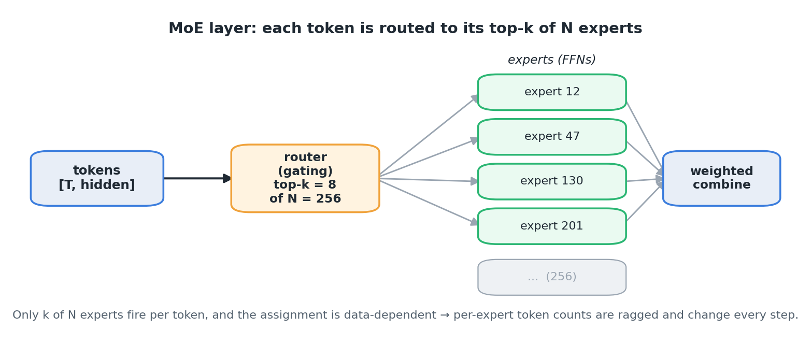
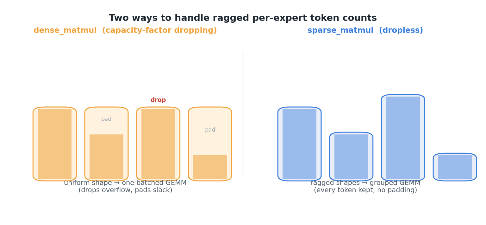
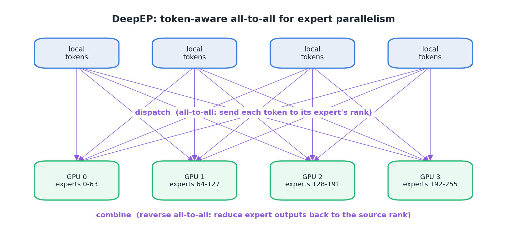
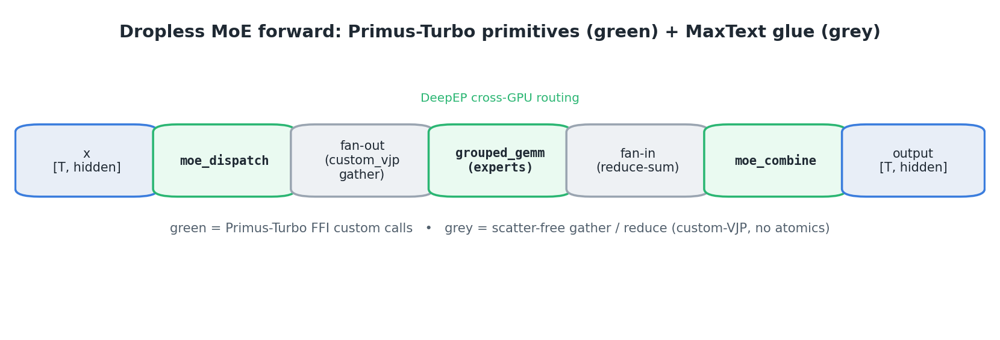

<!---
Copyright (c) 2026 Advanced Micro Devices, Inc. (AMD)

Permission is hereby granted, free of charge, to any person obtaining a copy
of this software and associated documentation files (the "Software"), to deal
in the Software without restriction, including without limitation the rights
to use, copy, modify, merge, publish, distribute, sublicense, and/or sell
copies of the Software, and to permit persons to whom the Software is
furnished to do so, subject to the following conditions:

The above copyright notice and this permission notice shall be included in all
copies or substantial portions of the Software.

THE SOFTWARE IS PROVIDED "AS IS", WITHOUT WARRANTY OF ANY KIND, EXPRESS OR
IMPLIED, INCLUDING BUT NOT LIMITED TO THE WARRANTIES OF MERCHANTABILITY,
FITNESS FOR A PARTICULAR PURPOSE AND NONINFRINGEMENT. IN NO EVENT SHALL THE
AUTHORS OR COPYRIGHT HOLDERS BE LIABLE FOR ANY CLAIM, DAMAGES OR OTHER
LIABILITY, WHETHER IN AN ACTION OF CONTRACT, TORT OR OTHERWISE, ARISING FROM,
OUT OF OR IN CONNECTION WITH THE SOFTWARE OR THE USE OR OTHER DEALINGS IN THE
SOFTWARE.
--->

# Dropless MoE Training in JAX with Primus-Turbo

Mixture-of-Experts (MoE) models have become a standard way to scale a transformer's
parameter count without paying the full compute bill — but training them efficiently on
GPUs forces an uncomfortable trade-off. The default path in JAX/MaxText keeps every
expert's tensors at a fixed shape and simply *drops* the tokens that overflow each expert's
capacity, trading model quality for speed. The fully *dropless* alternative keeps every
token, but in pure JAX it hits a memory wall that makes it impractical at production scale.

AMD's [Primus-Turbo](https://github.com/AMD-AGI/Primus-Turbo) closes that gap. It brings
two Composable Kernel (CK)-backed primitives to JAX — a **grouped GEMM** for the ragged,
variable-length expert matmuls and a **DeepEP dispatch/combine** all-to-all for token-aware
expert-parallel routing — and exposes them as first-class JAX ops through the XLA FFI,
without giving up autodiff, sharding, or numerical fidelity.

In this blog, you'll explore how we wired these kernels into a large MoE training graph in
[MaxText](https://github.com/AI-Hypercomputer/maxtext) behind two simple flags. You'll
learn how grouped GEMM and DeepEP work, how to integrate a custom kernel through JAX's FFI
— custom VJPs, sharding contracts, and a once-per-process bootstrap included — and how the
dropless path stacks up against the capacity-factor default on both throughput and
convergence. By the end, you'll see how Primus-Turbo turns dropless MoE training on AMD
Instinct GPUs from infeasible into a practical, faster, and more memory-efficient default.

---

## A Quick Tour of Mixture-of-Experts

A [Mixture-of-Experts (MoE)](https://arxiv.org/abs/1701.06538) layer replaces a transformer block's single
feed-forward network (FFN) with **many** FFNs ("experts") and a small **router**
that sends each token to only a few. It buys parameters — and capacity — without
the full FLOP bill, since each token still touches only its top-`k` experts.

A representative modern large MoE looks like this:

- dozens of decoder layers, hidden size in the thousands, and a large vocabulary;
- **hundreds of routed experts** per MoE layer (e.g. 256), **top-k = 8**
  (plus shared experts);
- a sigmoid router with a learned per-expert bias for load balancing.

The figure below traces how a single token flows through one such layer — routed to
its top-k of N experts, processed, and recombined by a weighted sum:



The hard part of MoE is not the experts — they are ordinary GEMMs — it is the
**routing**. Each token's top-k assignment is data-dependent and changes every
step, so the per-expert token counts are *ragged* and *dynamic*. Two things
follow from that:

1. The per-expert matmul is a **grouped** GEMM (a batch of GEMMs with different
   `M` dimensions), not a single dense GEMM.
2. Under **expert parallelism** (EP), where experts live on different GPUs,
   the tokens have to be physically shuffled to the GPU that owns their expert
   and shuffled back afterwards — an **all-to-all** whose message sizes are
   themselves data-dependent.

How a framework handles those two facts is what separates the implementations
below.

---

## `dense_matmul`: Capacity-Factor Dropping

The simplest way to make MoE shapes static is to **refuse to be ragged**. The
`dense_matmul` path (a common MaxText default) picks a *capacity* — the
capacity-factor idea from [GShard](https://arxiv.org/abs/2006.16668) and
[Switch Transformers](https://arxiv.org/abs/2101.03961):

```python
expert_capacity = capacity_factor * (num_tokens * top_k / num_experts)
```

Every expert is given a fixed-shape buffer of exactly `expert_capacity` slots.
Tokens are scattered into a `[num_experts, expert_capacity, hidden]` tensor; if
an expert is over-subscribed in a given step, the overflow tokens are **dropped**
(their contribution is zeroed), and if it is under-subscribed the buffer is
**padded**. The expert FFN is then a single **batched GEMM** over that uniform tensor.

The trade-offs are exactly what you'd expect:

- **Pro:** fully static, *uniform* shapes. The expert matmul is a plain batched
  GEMM — **lower-overhead than a grouped GEMM** (equal-sized groups tile cleanly,
  no per-group offsets or ragged edges) — so it's the most efficient matmul of
  any path, needs no custom kernel, and uses the cheapest memory (a fixed
  `num_experts * expert_capacity * hidden` tensor, regardless of routing skew).
- **Con:** it is **lossy**. `capacity_factor=1.25` drops a fraction of routed
  tokens every step; raising it to 2.0 or 4.0 recovers fidelity but spends the
  batched GEMM's FLOPs on padding and inflates memory. The trade-off is numerical
  correctness for shape convenience — not matmul performance; the dense path remains faster.

`dense_matmul` is the right baseline, but "drop tokens to keep shapes square"
is not what you want for faithful MoE training.

---

## `sparse_matmul`: Dropless Routing

The `sparse_matmul` path is **dropless**: every routed token reaches its expert,
no capacity, no padding-to-capacity, no dropped tokens. It does this by sorting
tokens by expert and running a *ragged* GEMM over the variable-length groups.

In MaxText's built-in implementation the pieces are:

- **permute:** `argsort` the flattened `[tokens * top_k]` expert assignments,
  gather the activations into expert-contiguous order, and compute
  `group_sizes[e]` = number of tokens for expert `e`;
- **expert matmul:** a ragged GEMM over those groups, one logical matmul per
  expert. MaxText's built-in `jax.lax.ragged_dot` is the natural choice, but its
  memory footprint is prohibitive at scale: pure `ragged_dot` **OOMs at ~444 GiB
  even at a per-device batch size (pdbs) of 1** — it can't train, the first reason
  to reach for a dedicated grouped-GEMM kernel (see [Grouped GEMM](#grouped-gemm-gmm));
- **unpermute + combine:** scatter the expert outputs back to token order and
  weight-sum the top-k contributions.

Under expert parallelism the cross-GPU shuffle is done with a
**`ragged_all_to_all`**. This is where dropless hurts. Because routing is
dynamic and there is no capacity cap, the number of tokens each rank receives is
a runtime value — but **`jax.jit` traces a fixed-shape graph, so the receive
buffer must be a static shape**, decided at trace time before any token is
routed. The only static shape guaranteed to hold is the **worst case**
(`num_ranks * tokens * hidden`, since any rank *could* send all its tokens to one
peer), so JAX is *forced* into allocating **pessimistically**. (Sizing it to the
true count instead would need a host round-trip — the device-to-host sync we
revisit under [*sync-free* allocation](#pessimistic-allocation-buys-something-back-its-sync-free).) That fixed memory tax scales with the per-device batch size, so
**it forces a smaller batch than the dense path**: at production scale (a large
MoE, hundreds of billions of parameters) the `ragged_all_to_all` buffer alone
pushes the dropless path to **OOM at ~242 GiB** at pdbs=8, where the dense path
happily runs to pdbs=16. Even with an efficient grouped-GEMM expert matmul, the
routing communication remains the primary bottleneck — dropless correctness, but
at a reduced batch size.

The figure below contrasts the two layouts side by side — capacity-factor dropping on
the left, the dropless ragged path on the right:



So dropless training hits **two memory walls** — the `ragged_dot` expert matmul
(the ~444 GiB above) and the `ragged_all_to_all` shuffle. The next two sections address these limitations in turn: a **grouped-GEMM kernel** that removes the matmul wall
([Grouped GEMM](#grouped-gemm-gmm)), and **DeepEP**, a leaner routing all-to-all that
trims the shuffle wall enough to claw back batch size ([DeepEP](#deepep)).

---

## Grouped GEMM (GMM)

A **grouped GEMM** computes a batch of independent matmuls that share the same
`K` and `N` but have **different `M`** per group:

```python
for e in range(num_experts):
    out[off[e] : off[e+1]] = a[off[e] : off[e+1]] @ b[e]   # [m_e, k] @ [k, n]
```

where `off = cumsum(group_lens)`. The whole thing is one kernel launch over a
contiguous `[sum(m_e), k]` activation tensor and a `[num_experts, k, n]` weight
tensor — exactly the operation the dropless expert FFN needs after tokens are
sorted by expert. No padding to capacity, no dropped tokens; the kernel walks
the group offsets and does the right-sized matmul for each expert.

The backward pass needs two grouped GEMMs:

- `grad_a = grad_c @ bᵀ` — another grouped GEMM (same group layout);
- `grad_b = aᵀ @ grad_c` — a **variable-`K`** grouped GEMM (the contraction
  dimension is the ragged one here).

A grouped GEMM carries more overhead than the dense path's uniform batched GEMM
([capacity-factor dropping](#dense_matmul-capacity-factor-dropping)) — variable per-group `M` means per-group offsets and ragged tile edges — so
it is not "free" relative to dense. But it is the matmul that lets you be
dropless at all, and a well-tuned grouped-GEMM kernel is the single most
important primitive for fast dropless MoE training (the approach
[MegaBlocks](https://arxiv.org/abs/2211.15841) introduced for GPUs).

---

## DeepEP

With the matmul wall handled by the grouped GEMM, the routing all-to-all is the
one that's left.
**[DeepEP](https://github.com/deepseek-ai/DeepEP)** is an expert-parallel communication library: a pair of
**dispatch** and **combine** kernels that implement the MoE all-to-all in a
**token-aware** way.

- **dispatch** sends each rank's local tokens to the rank(s) owning their
  selected experts (`topk_idx`), over NVLink/xGMI for intranode communication and RDMA for internode communication.
  Its receive buffer is still worst-case (`num_tokens * ep_size`) — DeepEP doesn't
  escape the pessimistic allocation of [dropless routing](#sparse_matmul-dropless-routing) — but it manages that buffer more leanly
  (chunked send/recv, fewer intermediate copies than a generic
  `ragged_all_to_all`), so the **transient footprint is somewhat smaller**.
- **combine** is the exact reverse: it sends each expert's outputs back to the
  ranks that contributed the tokens and reduces (sums) them at the destination.

The figure below shows this dispatch → expert-compute → combine round-trip across GPUs:



dispatch returns an opaque **handle** describing the communication layout
(rank/channel prefix matrices, source indices, send heads). The handle is fed
back to combine so it can undo the dispatch exactly, and it lets the backward
pass reuse the layout instead of recomputing it. Conceptually:
**dispatch's backward is a combine, and combine's backward is a dispatch.**

DeepEP gives you a dropless routing all-to-all that trims the transient
footprint of [dropless routing](#sparse_matmul-dropless-routing)'s pessimistic allocation — modestly, but enough to claw back a
step of batch size.

### Pessimistic Allocation Buys Something Back: It's *Sync-Free*

The worst-case receive buffer has a second, subtler payoff. The alternative —
allocating *exactly* the number of tokens each rank actually receives — means
the buffer shape depends on a value that only exists on the GPU after routing,
so you must copy those per-expert counts **back to the host** to set the shape.
That **device-to-host (D2H) synchronization** drains the CPU launch queue and
blocks compute/comm overlap. AMD's PyTorch/Megatron stack treats removing these
syncs as a headline optimization — [*Feature 3: Sync-Free MoE*](https://rocm.blogs.amd.com/software-tools-optimization/primus-moe-package/README.html#feature-3-sync-free-moe),
driven by a `num_worst_token` knob and by keeping the token counts as GPU
tensors — and explicitly notes the trade: the fully sync-free level "consumes
significantly more GPU memory."

Worst-case shapes are **static**, so no count ever round-trips to the host —
that is *why* pessimistic allocation is sync-free. In JAX this isn't even a knob:
`jax.jit` requires static shapes by construction, so the DeepEP primitive uses
`num_worst_tokens = num_tokens * ep_size` and the entire MoE forward traces
**sync-free by default**. (A data-dependent shape would force a host callback —
i.e. exactly the D2H stall the PyTorch stack works to eliminate.) So the
[dropless-routing](#sparse_matmul-dropless-routing) memory tax and a stall-free launch stream are two sides of the same decision.

---

## Primus-Turbo

We now have the two primitives a dropless MoE needs; on AMD GPUs they ship in
one library.

[Primus-Turbo](https://github.com/AMD-AGI/Primus-Turbo) is AMD's library of
high-performance training primitives for the ROCm stack (MI300/MI350-class
GPUs, gfx94x/gfx95x). It packages [Composable Kernel (CK)](https://github.com/ROCm/composable_kernel)-backed GEMMs,
normalization, quantization, FP8, and — the two we care about here — a
**grouped GEMM** and a **DeepEP dispatch/combine** implementation, with both
**PyTorch** and **JAX** front-ends.

The JAX front-end is the interesting one for MaxText, because exposing a
hand-written HIP/CK kernel to a `jax.jit`-traced, XLA-compiled, autodiff'd,
`shard_map`-partitioned program is not just "call the kernel" — it has to become
a first-class JAX primitive. That is exactly what Primus-Turbo's
`primus_turbo.jax` package does.

---

## How Primus-Turbo Implements GMM and DeepEP for JAX

### Custom Primitives over FFI

Each kernel is exposed as a JAX **primitive** whose lowering calls the C++/CK
kernel through the **[XLA FFI](https://docs.jax.dev/en/latest/ffi.html)** (foreign-function interface). On top of the raw
primitives, Primus-Turbo registers everything JAX needs to treat them as native
ops:

- **abstract evaluation** (shape/dtype rules) so tracing works;
- **`custom_vjp`** so autodiff works without XLA trying (and failing) to
  differentiate through an opaque call;
- **sharding rules** so the op partitions correctly under `shard_map` (FSDP).

**What's the alternative to FFI?** There are three, and none of them fit a
per-layer training hot path that calls into an existing CK/HIP kernel and a
[rocSHMEM](https://rocm.docs.amd.com/projects/rocSHMEM/en/latest/)-based all-to-all:

1. **Stay in pure JAX/XLA primitives** — express the op with `jax.lax.ragged_dot`
   and `jax.lax.ragged_all_to_all`. This needs *no* custom kernel, but the pure
   `ragged_dot` expert matmul is memory-prohibitive at scale (it can't train),
   and the generic `ragged_all_to_all` hits the [dropless-routing](#sparse_matmul-dropless-routing) memory wall — which is exactly
   why the dropless configs here use a grouped-GEMM kernel and DeepEP instead.
   There is no pure-XLA equivalent of DeepEP's IPC/RDMA dispatch.
2. **Write the kernel in [Pallas/Mosaic](https://docs.jax.dev/en/latest/pallas/index.html)** — JAX's in-tree kernel DSL, compiled by
   XLA with no external C++. Workable for the grouped GEMM, but you'd be
   *reimplementing* the CK kernel (and giving up its tuning), and Pallas has no
   path to the cross-rank rocSHMEM/IPC primitives DeepEP needs — so the
   communication half is a non-starter.
3. **Host callbacks** (`jax.pure_callback` / `io_callback`) — bounce the tensor
   out to a Python/C++ callback. The host round-trip is orders of magnitude too
   slow for an op invoked on every MoE layer, and it composes poorly with `jit`,
   donation, autodiff, and `shard_map`.

FFI is the right tool precisely because it lets the **existing**, optimized CK
grouped GEMM and DeepEP communication run **in-graph** as an XLA custom-call —
no host round-trip, no kernel rewrite — while `custom_vjp` gives JAX what it
needs to differentiate and partition around the opaque call.

### Grouped GEMM

The public API is small:

```python
from primus_turbo.jax.lax.grouped_gemm import grouped_gemm, compute_group_offs

out = grouped_gemm(a, b, group_lens, transA=False, transB=False, num_cu=-1)
```

Under the hood `grouped_gemm` is a `jax.custom_vjp`. The forward binds the CK
grouped-GEMM primitive (`ck_grouped_gemm_p`); the backward issues the two
grouped GEMMs from [the grouped-GEMM section](#grouped-gemm-gmm) — a standard one for `grad_a` and a **variable-K** variant
(`ck_grouped_gemm_variable_k_p`) for `grad_b`. `compute_group_offs` turns
`group_lens` into the `[num_experts+1]` offset array the kernel walks. The CK
kernel requires **int64** group lengths, which becomes a small but important
integration detail later (see [the correctness details](#the-subtle-bits-that-make-it-correct)).

### DeepEP Dispatch/Combine

The public API mirrors the concept from [DeepEP](#deepep):

```python
from primus_turbo.jax.lax.moe import setup, moe_dispatch, moe_combine

setup(mesh=mesh, ep_axis_name="expert", hidden_bytes=emb_dim * 2)   # once per process
recv_x, recv_idx, recv_w, handle = moe_dispatch(x, topk_idx, topk_w, num_experts)
out = moe_combine(expert_out, handle)
```

Two design points stand out in the JAX implementation:

**A one-call `setup()` that freezes the runtime.** DeepEP has three runtime
modes — single-process multi-GPU (INPROC), one-GPU-per-process intranode
(PER_PROCESS, ≤8 ranks over NVLink/xGMI), and one-GPU-per-process internode
(PER_PROCESS over RDMA, >8 ranks). `setup()` auto-detects the mode from
`jax.process_count()` / `jax.local_device_count()`, pins the expert-parallel
communication group from the JAX `Mesh` on the `"expert"` axis, sizes the
per-process NVL/RDMA buffer from `hidden_bytes`, issues the cross-host barrier
that the internode rocSHMEM handshake needs, and then **freezes** all of that
(mode, EP size, SM count) into an immutable snapshot. After freezing, every
`moe_dispatch`/`moe_combine` reads the snapshot instead of re-querying mutable
globals on every trace — tighter HLO, and a clear `RuntimeError` if you forget
to call `setup()` rather than an opaque C++ crash.

**dispatch/combine are each a `custom_vjp` whose backward is the other.** The
combine's VJP runs a dispatch with the saved handle; the dispatch's VJP runs the
combine. The handle threads the communication layout from forward to backward so
no layout is recomputed.

---

## The FFI Integration in MaxText

The MaxText side of the work
([`ROCm/maxtext @ feature/primus-turbo-gmm-deepep-integration`](https://github.com/ROCm/maxtext/tree/feature/primus-turbo-gmm-deepep-integration))
is **two self-contained commits** —
[grouped GEMM](https://github.com/ROCm/maxtext/commit/9aeaa97b22676842a2d73e18146ff1b2f37b3a7f)
and
[DeepEP dispatch/combine](https://github.com/ROCm/maxtext/commit/1c5729088c0c2463eae108ffaeaa3735b7395f51) —
that wire Primus-Turbo into `MaxText/layers/moe.py` behind
two config flags, with **zero overhead when the flags are off**.

| Flag | Effect | Primus-Turbo primitives used |
|---|---|---|
| `use_turbo_grouped_gemm=true` | replace the dropless expert matmul | `grouped_gemm`, `compute_group_offs` |
| `use_turbo_deepep_dispatch=true` | replace the EP all-to-all | `moe_dispatch`, `moe_combine` (+ grouped GEMM) |

### Grouped GEMM Swap

Inside the `sparse_matmul` ragged-GEMM site, `use_turbo_grouped_gemm` selects
Primus-Turbo's `grouped_gemm` in place of `ragged_dot`/Megablox. The activations
are already sorted by expert and `group_sizes` is already computed, so this is a
drop-in for the matmul itself.

### DeepEP Dispatch/Combine Swap

When `use_turbo_deepep_dispatch` is on and there's more than one expert-parallel
shard, the routing path becomes: `moe_dispatch` → fan-out to the sorted
per-expert layout → grouped GEMM → fan-in → `moe_combine`. The dispatch handle
is carried in a small `_DeepEPCombineState` named tuple from the dispatch site
to the combine site.

The figure below shows the full forward data flow — Primus-Turbo FFI custom calls in
green, the scatter-free MaxText glue in grey:



### The Lazy, Once-Per-Process `setup()` Bootstrap

DeepEP's `setup()` must run **in whichever process executes the MoE forward**,
because Primus-Turbo pins the EP communication group per process. With a
single-controller launch that's the main process; under a Ray-based launch it's
each worker actor — and a driver-side bootstrap would miss the actors entirely.
The integration therefore folds `setup()` into a once-per-process guarded helper
called at the top of the DeepEP branch of the MoE forward:

```python
def _ensure_deepep_setup(mesh, config):
    global _deepep_setup_done
    if _deepep_setup_done:
        return
    try:
        from primus_turbo.jax.lax.moe import setup as _deepep_setup
    except ImportError:
        _deepep_setup = None
    if _deepep_setup is not None:
        _deepep_setup(mesh=mesh, ep_axis_name="expert", hidden_bytes=config.emb_dim * 2)
    _deepep_setup_done = True
```

The guarded import keeps the integration working against both newer Primus-Turbo
(which requires explicit `setup()`) and older builds (which auto-bootstrap and
expose no `setup()`).

### The Subtle Bits That Make It Correct

A faithful integration is more than calling the kernels. The parts that required care were:

- **Fan-out / fan-in without atomic scatters.** After dispatch, tokens must be
  fanned out to the `[N*K, hidden]` sorted-by-expert layout and, after the
  experts run, folded back to one row per received token. Naively this is a
  duplicate-index gather whose autodiff emits an **atomic scatter-add** on the
  backward — slow and non-deterministic. The integration implements the fan-out as a
  `custom_vjp`: the forward is a single composed gather `recv_x[sort_idx // K]`;
  the backward inverts the permutation with `argsort` and folds the top-k
  duplicates with a plain **reduce-sum**, never a scatter. Fan-in is a reshape +
  weighted `sum` over the `top_k` axis (float32 accumulation), again no scatter.
- **Masking out-of-group rows.** Rows beyond `sum(group_sizes)` are zeroed at
  both the dispatch fan-out and before combine; without that, garbage gradients
  from padding rows fold back through the reduce-sum and stall training at
  initialization.
- **int64 group lengths, thread-locally.** The CK grouped GEMM requires int64
  `group_lens`, but flipping global x64 on breaks `argsort` (an XLA-ROCm
  s32/s64 scatter mismatch). The integration wraps just the kernel call in
  `jax.experimental.enable_x64()` — thread-local, safe for concurrent
  `shard_map` threads.
- **bf16 only.** The DeepEP path asserts `dtype == bfloat16`; FP8 dispatch is a
  separate kernel surface and is explicitly out of scope here.

The net effect: turning on the two flags gives you a **dropless** MoE
that routes every token through DeepEP and runs the experts through a CK grouped
GEMM, differentiates correctly, and traces cleanly under FSDP — while the default
(`sparse_matmul=false`) graph is byte-for-byte unchanged.

---

## Experiments

Primus-Turbo is designed to make dropless MoE practical on AMD Instinct GPUs; the experiments in this section evaluate how well it delivers on that promise and answer these empirical questions: is dropless feasible, is it fast, and does it actually train better?

**Setup.** All runs are [DeepSeek-V3 671B](https://arxiv.org/abs/2412.19437) on **8 nodes × 8 AMD MI355X** (64 GPUs,
288 GB HBM/device), sequence length 4096, FSDP=8, bf16, `remat_policy: full`. The
base job config is
[`configs/deepseek3-671b.gpu.yml`](https://github.com/AMD-AGI/maxtext-slurm/blob/ad3c5245ae5cb82df79d49b213014c1fc6669391/configs/deepseek3-671b.gpu.yml);
the five configs below differ only in the MoE flags layered on top of it. The
software stack is the **`rocm/jax-training:maxtext-v26.2`** container with
**Primus-Turbo (JAX build, gfx950) installed manually** on top. Five configs:

| Tag | Path |
|---|---|
| `dense-cf{1.25,2,4}` | capacity-factor dropping (`dense_matmul`) |
| `sparse-gmm` | dropless via Primus-Turbo grouped GEMM + `ragged_all_to_all` |
| `sparse-gmm-deepep` | **dropless via Primus-Turbo grouped GEMM + DeepEP** |

Note that **vanilla `sparse_matmul`** (pure `jax.lax.ragged_dot`, no grouped-GEMM
kernel) is not in this list: it OOMs at ~444 GiB even at pdbs=1, so it is
infeasible to train at this scale. Both dropless configs above therefore use the
Primus-Turbo grouped GEMM, and differ only in the all-to-all (`ragged_all_to_all`
vs DeepEP) — which is what makes their head-to-head a clean isolation of the
routing communication.

> **Scope.** This is a controlled A/B comparison, not a peak-performance
> benchmark. Every config runs the same fixed recipe with no per-config kernel or
> XLA tuning, so the **relative** gaps between configs are the result — read the
> deltas, not the absolute magnitudes. The absolute throughput is a floor (there
> is tuning headroom), not a ceiling.

### Throughput (Synthetic Data)

Steady-state tokens/s/device (TGS), `dataset_type=synthetic`, mean over steps
5–14 (FSDP=8):

| pdbs | dense-cf1.25 | dense-cf2 | dense-cf4 | sparse-gmm | sparse-gmm-deepep |
|-----:|-------------:|----------:|----------:|-----------------:|---------------------:|
|    4 |        961.1 |     813.1 |     532.6 |            757.1 |                873.4 |
|    7 |       1209.8 |     934.3 |     575.5 |          974.5 † |               1121.6 |
| **8**|       1292.7 |     960.1 |     580.7 |    **OOM** 242 GiB |           **1179.7** |
|    9 |       1399.0 |     994.8 | OOM 212 GiB |    OOM 242 GiB |               1189.4 |
|   16 |       1438.1 |    1015.1 | OOM 278 GiB |              —   |            OOM 316 GiB |

† `sparse-gmm` at pdbs=7 only fits with a reduced memory fraction.

### What the Numbers Say

- **DeepEP claws back a step of batch size.** Both dropless paths pay the
  pessimistic worst-case allocation of [dropless routing](#sparse_matmul-dropless-routing), but DeepEP's buffer management is
  somewhat leaner — a ~40 GiB (~15%) lower transient at equal pdbs. That modest
  reduction is enough to cross the feasibility threshold: the built-in
  `sparse-gmm` path **OOMs at pdbs=8** (~242 GiB), while
  `sparse-gmm-deepep` runs at pdbs=8 and even pdbs=9. It doesn't make dropless
  cheap — it makes it fit one notch higher.
- **DeepEP is the fastest dropless option.** Across every feasible pdbs,
  `sparse-gmm-deepep` beats `sparse-gmm` (e.g. 1121.6 vs 974.5 at
  pdbs=7) and lands within striking distance of the lossy `dense-cf1.25`
  baseline while being **dropless**. Peak dropless throughput is
  `sparse-gmm-deepep` at pdbs=8 → **1179.7 TGS**.
- **The capacity-factor tax is real.** `dense-cf2`/`dense-cf4` raise fidelity by
  raising capacity, but throughput collapses (cf4 ≈ 575 TGS and OOMs above
  pdbs=8). The dropless DeepEP path delivers full fidelity at roughly **2× the
  cf4 throughput**.

### Convergence and Loss Quality (C4 Data)

The synthetic sweep above measures **throughput and feasibility only** — fixed
inputs over a short run say nothing about whether the model learns correctly. For
that we need a real training run — DeepSeek-V3 671B on
**[C4](https://arxiv.org/abs/1910.10683)** (`dataset_type=grain`, parquet
`c4-train-*-of-01024.parquet`, HF
`deepseek-ai/DeepSeek-V3-Base` tokenizer, seq 4096), **2000 steps**, FSDP=8,
pdbs=7, same initialization, all five configs. The per-step training loss (TensorBoard
`learning/loss`) is plotted in the figure below:


(These C4 runs used an earlier build of the same integration — the kernels and
routing algorithm are identical to the current one.)

Two clean conclusions:

1. **DeepEP dropless matches the `ragged_all_to_all` dropless path.** The two
   paths share the *same* grouped-GEMM expert matmul and differ only in the
   all-to-all, so ideally their curves would be identical. In practice
   `sparse-gmm-deepep` (5.003) and the `ragged_all_to_all` `sparse-gmm` (4.999)
   agree to **0.004** at step 2000 and track each other across the entire curve.
   That residual is run-to-run **non-determinism** accumulated over 2000 steps
   (non-deterministic reductions / kernel scheduling), not an algorithmic gap —
   the DeepEP communication + grouped GEMM + custom-VJP fan-out/fan-in reproduce
   dropless training end-to-end, not just step-locally.
2. **Dropless is Pareto-superior to capacity-factor dropping** at the same batch
   size — `sparse-gmm-deepep` beats `dense-cf{1.25, 2, 4}` on *both* axes:

   - **Lower loss at a fixed step** (convergence quality — more learned per step).
     Both dropless paths converge below every dense config, and within the dense
     family the loss falls monotonically with capacity
     (cf1.25 = 5.163 → cf2 = 5.119 → cf4 = 5.081): the fewer tokens you drop, the
     lower the loss, and **dropless is the limit**. DeepEP reaches **5.003 — a
     0.16-nat improvement over the `dense-cf1.25` default** — because it drops
     nothing.
   - **Lower loss at a fixed wall-clock time** (time-to-loss). On C4 the dropless
     path runs ~19% fewer steps per hour than `dense-cf1.25` (818 vs 1009 TGS;
     the throughput cost is broken down in [the next section](#the-throughput-cost-on-real-data)), yet it still reaches a *lower*
     loss at equal wall-clock — the per-step quality gain more than pays back the
     lost step rate.

The figure below makes this time-to-loss comparison concrete, plotting loss against
wall-clock time for the dropping default and the dropless path:


### The Throughput Cost on Real Data

There is one cost to be honest about. Moving from synthetic to real C4 data lowers
every config's TGS — but most of that is just the data-loading overhead the
synthetic loader doesn't pay, and it hits dense and dropless alike (`dense-cf1.25`
itself drops ~17%). The dropless-specific signal is the **gap between
`dense-cf1.25` and the dropless paths**, which widens sharply on real data. TGS at
pdbs=7 (FSDP=8):

| config | synthetic | C4 |
|---|---:|---:|
| dense-cf1.25 | 1210 | 1009 |
| dense-cf2 | 934 | 810 |
| dense-cf4 | 576 | 522 |
| sparse-gmm | 975 | 753 |
| **sparse-gmm-deepep** | 1122 | **818** |

`sparse-gmm-deepep` trails `dense-cf1.25` by only **~7%** on synthetic (1122 vs
1210), but by **~19%** on C4 (818 vs 1009). Because `dense-cf1.25` is
structurally **immune to routing skew** — capacity-factor dropping pads every
expert to a fixed size no matter how tokens route — that *extra* widening is the
cost of **routing imbalance** on the dropless path: real text concentrates tokens
on a few popular experts, so the ragged grouped GEMM and the dispatch/combine
all-to-all stall on the busiest expert. Synthetic routing is near-uniform and
hides this.

Importantly, this imbalance is **tunable, not fixed**: a stronger MoE load-balancing (auxiliary) loss or [router z-loss](https://arxiv.org/abs/2202.08906) tuning strategy would flatten the per-expert token distribution and narrow the gap.
None of the runs here touched those
knobs — every config used the model's default routing and loss settings — so the
measured tax is an **upper bound**, not an inherent property of the dropless path.

Even so, two results hold on real data:

- **`sparse-gmm-deepep` is markedly faster than `sparse-gmm`** (818 vs 753, +9%):
  DeepEP's dispatch tolerates the imbalance better than the `ragged_all_to_all`
  path.
- **`sparse-gmm-deepep` stays at or above `dense-cf2`** (818 vs 810) — the dropless
  DeepEP path matches a mid-capacity dense config on throughput while being
  strictly better on loss.

The per-device throughput on C4 is summarized in the figure below:


And this throughput tax is **already paid for** by the time-to-loss result of [Convergence and Loss Quality](#convergence-and-loss-quality-c4-data):
even after giving up ~19% step rate to `dense-cf1.25`, `sparse-gmm-deepep` still
reaches lower loss at equal wall-clock. The imbalance cost is real, but the
convergence-quality gain more than covers it.

---

## Summary

Dropless MoE has historically forced an unhappy choice on the ROCm/JAX stack:
keep shapes square and **drop tokens** (`dense_matmul`), or stay **dropless** and
hit the memory walls of the ragged path — a prohibitively expensive `ragged_dot`
expert matmul and a worst-case `ragged_all_to_all` shuffle (`sparse_matmul`).
Primus-Turbo removes the dilemma by bringing two CK-backed primitives to JAX — a
**grouped GEMM** for the ragged expert matmul and a **DeepEP dispatch/combine**
for a token-aware routing all-to-all — and exposing them as first-class JAX ops
with autodiff, `shard_map` sharding, and a clean `setup()` contract.

Wired into MaxText behind two `use_turbo_*` flags — with careful custom-VJP
fan-out/fan-in, out-of-group masking, thread-local int64, and a once-per-process
bootstrap that covers both single-controller and Ray launches — the result is an
MoE training path that is:

- **dropless** (every token reaches its expert),
- **less memory-constrained** (its leaner all-to-all buffer claws back a batch-size
  step — fits pdbs=8–9 where the `ragged_all_to_all` path OOMs at 8),
- **the fastest dropless option** (~1180 TGS at pdbs=8, ~2× the cf4 capacity path),
- **numerically faithful** (loss tracks the `ragged_all_to_all` dropless path to
  0.004 over a 2000-step C4 run),
- and **Pareto-superior to capacity-factor dropping** at equal batch size — lower
  C4 loss both per step (5.003 vs 5.163 for `dense-cf1.25`) and per wall-clock,

all with **zero overhead** when the flags are off. Kernels, memory, throughput,
gradients, and end-to-end C4 convergence are all verified (FSDP=8).

The credit for making this practical goes to Primus-Turbo: by providing CK-backed
grouped GEMM and DeepEP kernels as clean, autodiff- and sharding-aware JAX ops, it turns
dropless MoE on AMD Instinct GPUs from an infeasible research path into a default you can
turn on with a single flag. If you train MoE models in JAX/MaxText, we encourage you to
enable the flags on your own runs and evaluate the benefits of dropless training firsthand.

---

## Additional Resources

### Mixture-of-Experts

- Shazeer et al., *Outrageously Large Neural Networks: The Sparsely-Gated
  Mixture-of-Experts Layer* (2017) — [arXiv:1701.06538](https://arxiv.org/abs/1701.06538)
- Lepikhin et al., *GShard* (2020) — [arXiv:2006.16668](https://arxiv.org/abs/2006.16668);
  Fedus et al., *Switch Transformers* (2021) — [arXiv:2101.03961](https://arxiv.org/abs/2101.03961)
  (the capacity-factor / token-dropping lineage of [`dense_matmul`](#dense_matmul-capacity-factor-dropping))
- Gale et al., *MegaBlocks: Efficient Sparse Training with Mixture-of-Experts*
  (2022) — [arXiv:2211.15841](https://arxiv.org/abs/2211.15841) (dropless / grouped-GEMM; see [`sparse_matmul`](#sparse_matmul-dropless-routing) and [Grouped GEMM](#grouped-gemm-gmm))
- Zoph et al., *ST-MoE: Designing Stable and Transferable Sparse Expert Models*
  (2022) — [arXiv:2202.08906](https://arxiv.org/abs/2202.08906) (router z-loss; see [The Throughput Cost on Real Data](#the-throughput-cost-on-real-data))
- DeepSeek-AI, *DeepSeekMoE* (2024) — [arXiv:2401.06066](https://arxiv.org/abs/2401.06066);
  *DeepSeek-V3 Technical Report* (2024) — [arXiv:2412.19437](https://arxiv.org/abs/2412.19437)

### Systems & Libraries

- DeepEP (DeepSeek expert-parallel dispatch/combine) —
  [github.com/deepseek-ai/DeepEP](https://github.com/deepseek-ai/DeepEP)
- Composable Kernel (CK), the GEMM backend —
  [github.com/ROCm/composable_kernel](https://github.com/ROCm/composable_kernel)
- rocSHMEM (GPU-centric OpenSHMEM, DeepEP's internode substrate) —
  [rocm.docs.amd.com/projects/rocSHMEM](https://rocm.docs.amd.com/projects/rocSHMEM/en/latest/)
- JAX foreign-function interface (FFI) —
  [docs.jax.dev/en/latest/ffi.html](https://docs.jax.dev/en/latest/ffi.html)
- JAX Pallas (in-tree kernel DSL) —
  [docs.jax.dev/en/latest/pallas](https://docs.jax.dev/en/latest/pallas/index.html)
- C4 (Colossal Clean Crawled Corpus), the training data — Raffel et al., *T5*
  (2019) — [arXiv:1910.10683](https://arxiv.org/abs/1910.10683)
- MaxText — [github.com/AI-Hypercomputer/maxtext](https://github.com/AI-Hypercomputer/maxtext);
  the integration lives on the AMD fork branch
  [`ROCm/maxtext @ feature/primus-turbo-gmm-deepep-integration`](https://github.com/ROCm/maxtext/tree/feature/primus-turbo-gmm-deepep-integration)
- Primus-Turbo — [github.com/AMD-AGI/Primus-Turbo](https://github.com/AMD-AGI/Primus-Turbo)
- maxtext-slurm (the launcher used for these runs — for launching and observing
  MaxText training on Slurm-managed GPU clusters) —
  [github.com/AMD-AGI/maxtext-slurm](https://github.com/AMD-AGI/maxtext-slurm)
- PyTorch/Megatron counterpart (Primus-Turbo MoE, incl. *Sync-Free MoE*):
  [MoE Training Best Practices on AMD GPUs](https://rocm.blogs.amd.com/software-tools-optimization/primus-moe-package/README.html)

## Disclaimers

The information presented in this document is for informational purposes only and may contain technical inaccuracies, omissions, and typographical errors. The information contained herein is subject to change and may be rendered inaccurate for many reasons, including but not limited to product and roadmap changes, component and motherboard version changes, new model and/or product releases, product differences between differing manufacturers, software changes, BIOS flashes, firmware upgrades, or the like. Any computer system has risks of security vulnerabilities that cannot be completely prevented or mitigated. AMD assumes no obligation to update or otherwise correct or revise this information.

However, AMD reserves the right to revise this information and to make changes from time to time to the content hereof without obligation of AMD to notify any person of such revisions or changes.

THIS INFORMATION IS PROVIDED "AS IS." AMD MAKES NO REPRESENTATIONS OR WARRANTIES WITH RESPECT TO THE CONTENTS HEREOF AND ASSUMES NO RESPONSIBILITY FOR ANY INACCURACIES, ERRORS, OR OMISSIONS THAT MAY APPEAR IN THIS INFORMATION. AMD SPECIFICALLY DISCLAIMS ANY IMPLIED WARRANTIES OF NON-INFRINGEMENT, MERCHANTABILITY, OR FITNESS FOR ANY PARTICULAR PURPOSE. IN NO EVENT WILL AMD BE LIABLE TO ANY PERSON FOR ANY RELIANCE, DIRECT, INDIRECT, SPECIAL, OR OTHER CONSEQUENTIAL DAMAGES ARISING FROM THE USE OF ANY INFORMATION CONTAINED HEREIN, EVEN IF AMD IS EXPRESSLY ADVISED OF THE POSSIBILITY OF SUCH DAMAGES.

AMD, the AMD Arrow logo, AMD Instinct, AMD ROCm, and combinations thereof are trademarks of Advanced Micro Devices, Inc. PyTorch is a registered trademark of Meta Platforms, Inc. Other product names used in this publication are for identification purposes only and may be trademarks of their respective companies.

© 2026 Advanced Micro Devices, Inc. All rights reserved
